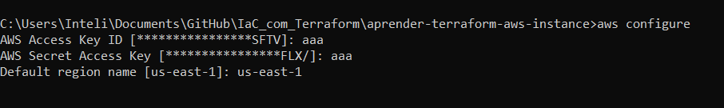

# IaC_com_Terraform

## Passos para a execução:

1. Criar arquivo main.tf

```
    terraform {
        required_providers {
            aws = {
            source  = "hashicorp/aws"
            version = "~> 4.16"
            }
        }

        required_version = ">= 1.2.0"
        }

        provider "aws" {
        region = "us-east-1"
        }

        resource "aws_instance" "app_server" {
        ami           = "ami-830c94e3"
        instance_type = "t2.micro"

        tags = {
            Name = "ExampleAppServerInstance"
        }
    }

```

2. Instalar AWS CLI:

Após instalar a CLI da AWS, é necessário colocar as credências da conta da AWS com o seguinte comando:

```
aws configure
```


Além disso, como estou usando a AWS academy é necessário passar o token de acesso, por meio do comando:

```
    aws configure set aws_session_token SESSIONTOKENHERE
```


3. Depois dessas configurações é necessário dar os seguintes comandos:

* Usado para inicializar um  diretório de trabalho do Terraform
    ```
        terraform init
    ```

* Usado para formatar o código do Terraform de acordo com as convenções de estilo recomendadas pelo Terraform.
    ```
        terraform fmt
    ```

* Usado para validar a sintaxe e a semântica do código do Terraform. 
  

    ```
        terraform validate
    ```


* Usado para criar um plano de execução do Terraform.

    ```
        terraform plan
    ```


* Usado para aplicar as mudanças planejadas à infraestrutura. 

    ```
        terraform apply
    ```


## Infraestrutura na AWS:

1. Instância do EC2 na AWS:

Entrando no [console ec2](https://us-west-2.console.aws.amazon.com/ec2/home?region=us-west-2#Instances:sort=instanceId) é possivel acompanhar a instancia criada pelo Terraform


2. Inspecionar estado do ambiente Terraform:

```
    terraform show
```


